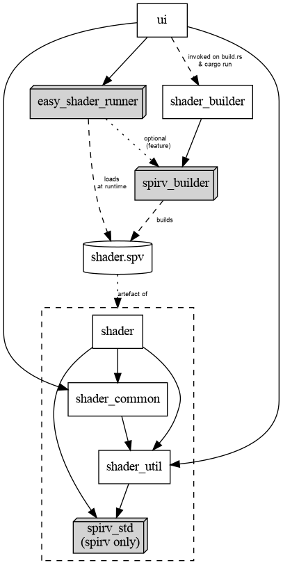

## Structure

<!--
  dot -Tpng workspace-structure.dot > workspace-structure.png
-->

## Releasing

Prerequisites:

- `cargo install git-cliff` and ensure that `~/.cargo/bin` is on your PATH.

Steps:

- Create release changeset
  - `cargo xtask changelog --bump major|minor|patch`
  - Update project version in `cargo.toml`
  - commit with prefix `chore(release)`
  - cargo build, to ensure the lockfile is updated
- Merge changeset as usual, update `dev` branches
- Create and push the new tag
- Create the release in Github. Sometimes it's useful to press the button to autogenerate the release notes; sometimes less so.
- ✨✨ automation happens ✨✨
- Confirm that the release artefacts built successfully.
- Update `main` branch
- Tag easy-shader-runner (e.g. `brot3-v1.2.3`) and push that tag, so the version used is retained.

### Manual build types

Debian package:

- `cargo xtask debian --release`
- _or equivalently:_
  - `cargo build --locked --release --no-default-features`
  - `cargo xtask debian --release --no-build`

AppImage, osx, alternative Debian:

- `cargo bundle -b brot3 -p brot3-ui -f <TYPE> -r --no-default-features`

Note that the OSX packages are lightly processed to turn them into clickable app images; refer to the relevant section of .github/workflows/build.yml .

Note that appimages produced by `cargo bundle` are not stripped by default.
