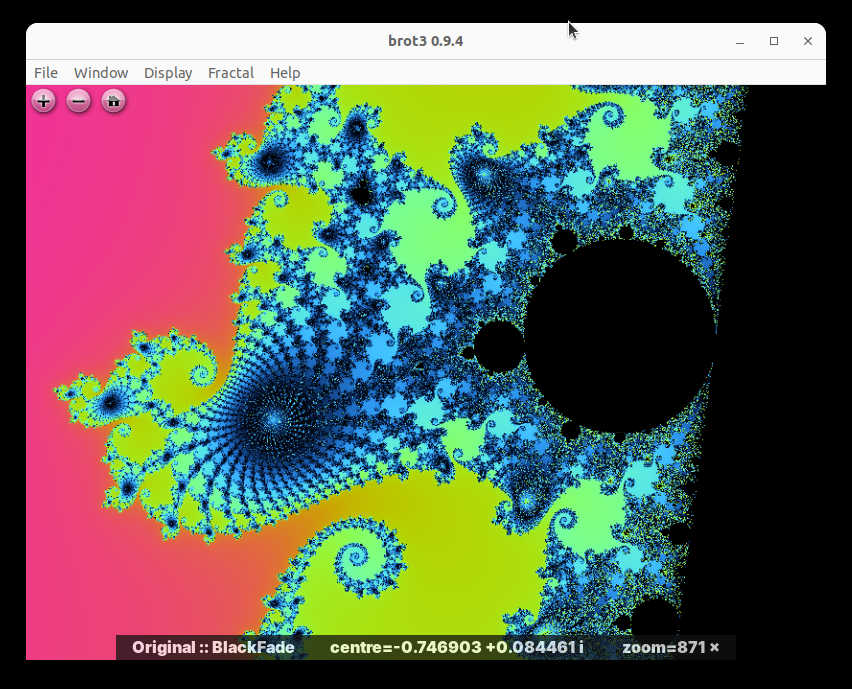

An interactive fractal explorer.

This is my third Mandelbrotter.
[brot2](https://github.com/crazyscot/brot2) was the previous incarnation.



This time it's in Rust, building a graphical UI using Tauri and OpenSeadragon.

More notes to come here when things are in less of a state of flux...

# Building

## Engine & CLI

Prerequisites:

- Rust toolchain (we target _stable_)

Use `cargo build` or `cargo build --locked` in the usual way.
There are unit tests, benchmarks and a reasonably strict `clippy` config.

There is no packaging configuration set up for the CLI at present.

You may care to use an alternative linker to speed up build times.
For example, you might set in your `~/.cargo/config.toml`:

```
[target.'cfg(target_os="linux")']
linker = "clang-19"
```

## GUI

Same as engine. There is no packaging configuration set up here yet.

## Releasing (notes to myself)

Prerequisites:

- `cargo install git-cliff` and ensure that `~/.cargo/bin` is on your PATH.

Steps:

- Create release changeset
  - Update project version in `cargo.toml`
  - `git cliff --tag v<intended new tag> > CHANGELOG.md`
  - commit with prefix `chore(release)`
- Merge changeset to main as usual
- Update `release` branch to the desired release point, push it to github.
- ✨✨ automation happens ✨✨
- Edit and publish the draft release in Github. You may find it useful to press the button to autogenerate the release notes; `git cliff` might also yield insights.
