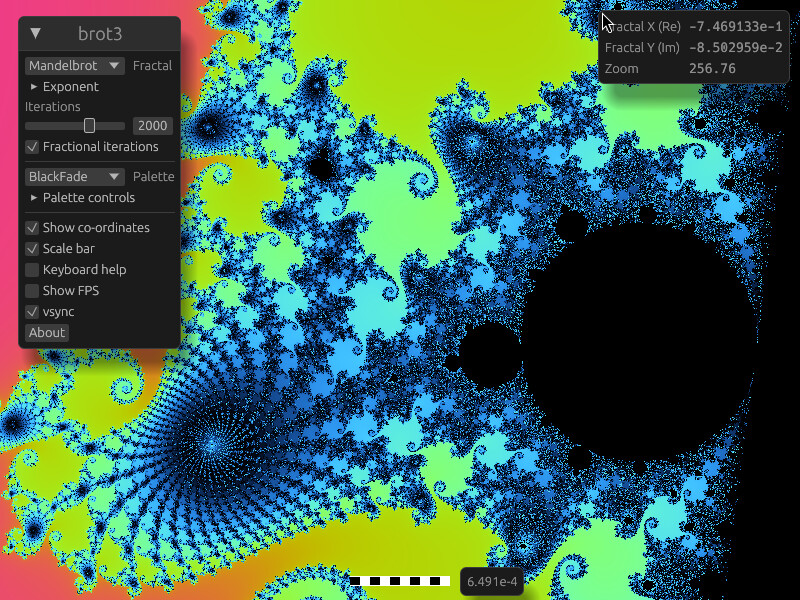

An interactive fractal explorer.

This is my third Mandelbrotter.
[brot2](https://github.com/crazyscot/brot2) was the previous incarnation.



This time it's in Rust and has itself something of a chequered history...

- brot3 1.0 started out using Tauri and OpenSeadragon for its UI.
- Version 2.0 (never released) was an attempt to rework the GUI using slint.
- The 3.0 branch is a significant overhaul, rendering on the GPU using [rust-gpu](https://github.com/rust-gpu/rust-gpu), with GUI using [egui](https://crates.io/crates/egui).

More notes to come here when things are in less of a state of flux...

## Getting started

### Prerequisites

You only really need a recent version of the `cargo` tool.

We use a [toolchain file](rust-toolchain.toml) to select the rust-gpu recommended toolchain, which is currently a specific nightly build that you're unlikely to have to hand. This is required as rust-gpu makes significant use of compiler internals.

### Building / running

**Cargo will automatically install the required nightly toolchain if you don't already have it.**

`cargo run --locked` will launch the GUI in interactive mode. By default this runs with the `hot-reload-shader` feature.

If you want to build a useful standalone application binary, start with `cargo build --locked --no-default-features` to disable runtime shader compilation.

There are limited unit tests and benchmarks.

### Speeding up build times

You may care to use an alternative linker to speed up build times.

For example, if you want to use the [wild linker](https://github.com/davidlattimore/wild) (`cargo binstall wild-linker`) this is what you might put in your `~/.cargo/config.toml`:

```
[target.x86_64-unknown-linux-gnu]
linker = "clang"
rustflags = ["-C", "link-arg=--ld-path=wild"]
```

## Releasing (notes to myself)

Prerequisites:

- `cargo install git-cliff` and ensure that `~/.cargo/bin` is on your PATH.

Steps:

- Create release changeset
  - Update project version in `cargo.toml`
  - `git cliff --tag v<intended new tag> > CHANGELOG.md`
  - commit with prefix `chore(release)`
- Merge changeset to main as usual
- Update `release` branch to the desired release point, push it to github.
- ✨✨ automation happens ✨✨
- Edit and publish the draft release in Github. You may find it useful to press the button to autogenerate the release notes; `git cliff` might also yield insights.

### Manual build types

Debian package:

- `cargo xtask debian --release`
- _or equivalently:_
  - `cargo build --locked --release --no-default-features`
  - `cargo xtask debian --release --no-build`

AppImage, osx, alternative Debian:

- `cargo bundle -b brot3 -p brot3-ui -f <TYPE> -r --no-default-features`
